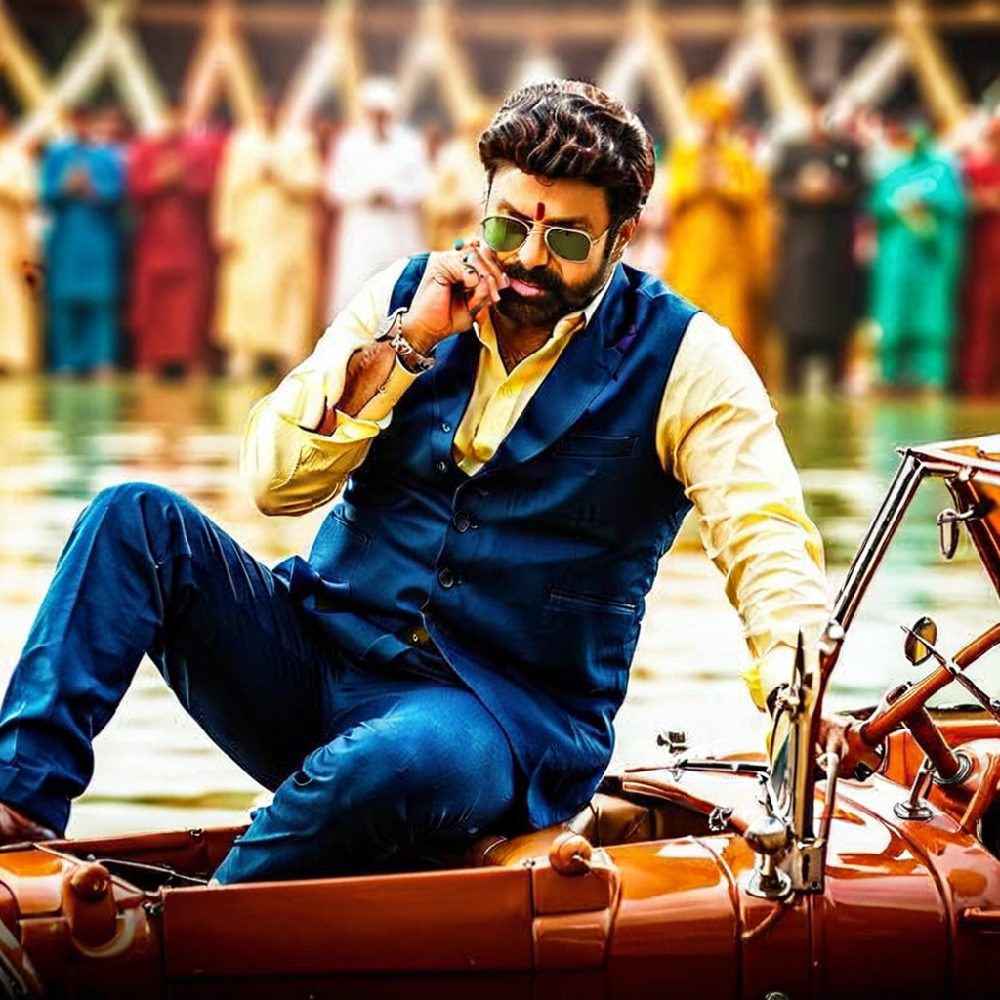
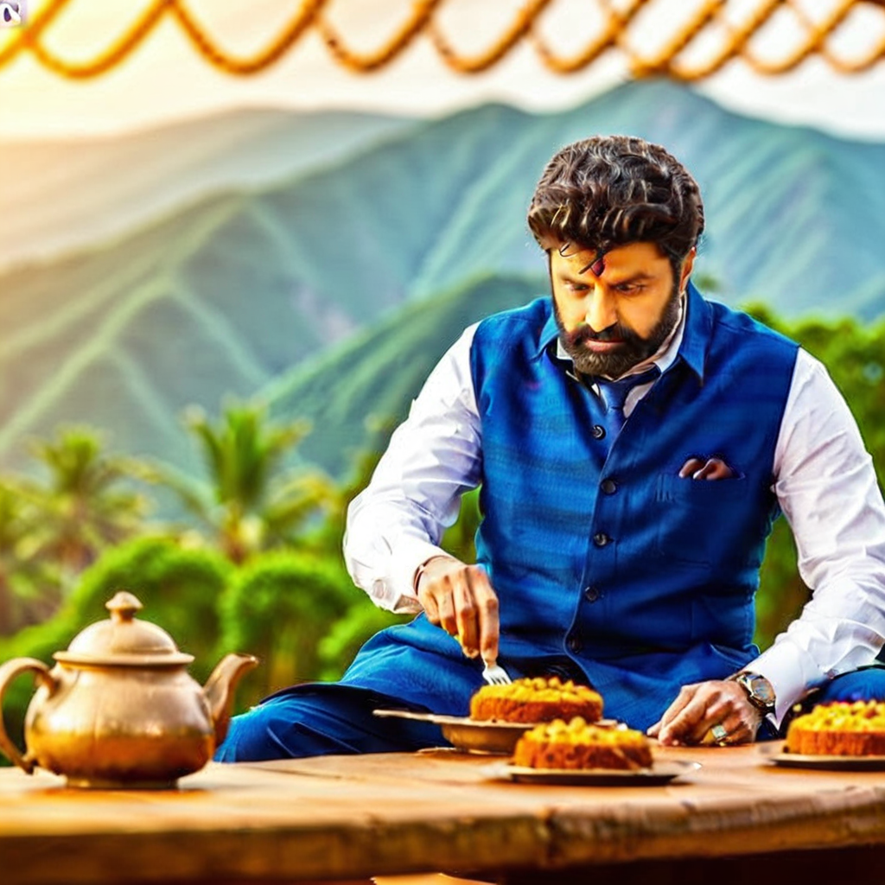

# Diffusers set-up for Dheyo AI

## Clone the Repository
```
git clone git@github.com:dheyoai/diffusers.git
cd diffusers
```

## Create Virtual Environment
```
python3.11 -m venv diffusers_env
source diffusers_env/bin/activate
```

## Set up diffusers as a Library
```
pip install -e .
```

## Install Dependencies
```
cd examples/dreambooth
pip install -r requirements.txt
```

## For AMD GPUs Only
```
pip install --pre --upgrade torch torchvision torchao --index-url https://download.pytorch.org/whl/nightly/rocm6.4
```

## Set your 🤗 Token
```
export HF_TOKEN=<>
```

## Launch your Fine-tuning Script

Create a custom accelerate config and add it to the accelerate command

```
accelerate launch --config_file /path/to/your/custom_config.yaml train_dreambooth.py \
  --pretrained_model_name_or_path=$MODEL_NAME  \
  --instance_data_dir=$INSTANCE_DIR \
  --output_dir=$OUTPUT_DIR \
  --instance_prompt="a photo of nbks man" \
  --resolution=512 \
  --train_batch_size=2 \
  --gradient_accumulation_steps=1 \
  --learning_rate=5e-6 \
  --lr_scheduler="constant" \
  --lr_warmup_steps=0 \
  --max_train_steps=400 
```

## Reproducing Dreambooth Balakrishna

### Fine-tuning command
#### For Stable Diffusion 3.5 Medium - Using Distributed Data Parallelism
```
accelerate launch --config_file config/accelerate_dist.yaml train_dreambooth_sd3.py \ 
      --pretrained_model_name_or_path=stabilityai/stable-diffusion-3.5-medium  \
      --instance_data_dir="./balakrishna_pngs" \
      --output_dir="sd3_medium_balayya_3" \
      --instance_prompt="a photo of sks man" \
      --resolution=1024 --train_batch_size=1 \
      --gradient_accumulation_steps=1 \
      --learning_rate=2e-6 \
      --lr_scheduler="constant" \
      --lr_warmup_steps=100 \
      --max_train_steps=2000 \
      --train_text_encoder \
      --validation_prompt="a photo of sks man" \
      --num_validation_images=2 \
      --validation_epochs=5 \
      --seed 0 \
      --mixed_precision=bf16   \
      --with_prior_preservation \
      --prior_loss_weight=1.0 \
      --class_data_dir="sd3_medium_balayya_prior_preservation_outputs_2" \
      --class_prompt="a full photo of a middle-aged, slightly fat indian man with a mustache" \
      --num_class_images=128 \
      --checkpointing_steps 200 
```

#### For Stable Diffusion 3.5 Large (w/o Training Text Encoders) - Using DeepSpeed Stage-2
```
accelerate launch --config_file config/zero3.yaml train_dreambooth_sd3.py \   
      --pretrained_model_name_or_path=stabilityai/stable-diffusion-3.5-large \
      --instance_data_dir="./balakrishna_pngs" \
      --output_dir="sd3_large_no_text_encoder_training_balayya" \
      --instance_prompt="a photo of sks man" \
      --resolution=1024 \
      --train_batch_size=1 \
      --gradient_accumulation_steps=1 \
      --learning_rate=2e-6 \
      --lr_scheduler="constant" \
      --lr_warmup_steps=100 \
      --max_train_steps=1500 \
      --validation_prompt="a photo of sks man" \
      --num_validation_images=2 \
      --validation_epochs=5 \
      --seed 0 \
      --with_prior_preservation \
      --prior_loss_weight=1.0 \
      --class_data_dir="sd3_large_balayya_prior_preservation_outputs" \
      --class_prompt="a full photo of a middle-aged, slightly fat indian man with a mustache" \
      --num_class_images=128 \
      --checkpointing_steps 200 \
      --prior_generation_precision bf16

```


### Inference Script
```python
from diffusers import DiffusionPipeline, UNet2DConditionModel, PNDMScheduler, StableDiffusion3Pipeline, StableDiffusionPipeline
from transformers import CLIPTextModel
import torch
from diffusers.utils import load_image
device = torch.device("cuda" if torch.cuda.is_available() else "cpu")


pipeline = StableDiffusion3Pipeline.from_pretrained(
    "examples/dreambooth/sd3_large_no_text_encoder_training_balayya", dtype=torch.bfloat16,
).to(device)


image = pipeline(prompt="a photo of sks man drinking coffee, high detailed skin:1.2), 8k uhd, dslr, soft lighting, high quality, film grain, Fujifilm XT3", 
                 num_inference_steps=100, 
                 guidance_scale=20, 
                 negative_prompt="extra arms, extra fingers, extra legs, mutated hands, fused fingers, long neck, cross-eyed, long head, deformed hands, ugly, wrong proportion, low res, bad anatomy, worst quality, low quality").images[0]
image.save("inferenced_images/balayya34.png")

```

## Experiments with IP-Adapter and Stable Diffusion 3.5 Large

### Without Fine-tuning the text encoders

Original | Before Fine-tuning           |  After Fine-tuning
:-------------------------: | :-------------------------:|:-------------------------:
  |  | 
Original  | A photo of a man in beach | A photo of sks man on beach


Original | Before Fine-tuning           |  After Fine-tuning
:-------------------------: | :-------------------------:|:-------------------------:
  |  | 
Original  | A photo of a man in red shirt with spring background | A photo of sks man in red shirt with spring background


## Experiments with Stable Diffusion XL 

### Launch Command
```
accelerate launch --config_file config/accelerate_dist.yaml train_dreambooth_sdxl.py \
      --pretrained_model_name_or_path=stabilityai/stable-diffusion-xl-base-1.0  \
      --instance_data_dir="./balakrishna_pngs" \
      --output_dir="sdxl_full_training_balayya" \
      --instance_prompt="a photo of sks man" \
      --resolution=1024 \
      --train_batch_size=1 \
      --gradient_accumulation_steps=1 \
      --learning_rate=2e-6 \
      --lr_scheduler="constant" \
      --lr_warmup_steps=100 \
      --max_train_steps=2500 \
      --validation_prompt="a photo of sks man" \
      --num_validation_images=2 \
      --validation_epochs=5 \
      --seed 0 \
      --with_prior_preservation \
      --prior_loss_weight=1.0 \
      --class_data_dir="sdxl_full_balayya_prior_preservation_outputs" \
      --class_prompt="a full photo of a middle-aged, slightly fat indian man with a mustache" \
      --num_class_images=128 \
      --checkpointing_steps 200 \
      --prior_generation_precision bf16 \ 
      --train_text_encoder
```

### Some Raw Images

Output 1 | Output 2 | Output 3 | Output 4 |
:-------------------------: | :-------------------------:|:-------------------------: |:-------------------------:|
  |  |  | 
A photo of sks man in pink shirt  | A photo of sks man in green shirt and blue goggles | A photo of sks man with an angry expression | A photo of sks man near a pool 
  |  |  | 
sks man eating on a table  | A photo of sks man, smiling, in black shirt | A photo of sks man with white hair and white mustache | A photo of sks man waving to a crowd of people


### IP-Adapter Full 
Original | Before Fine-tuning           |  After Fine-tuning
:-------------------------: | :-------------------------:|:-------------------------:
  |  | 
Original  | A photo of a man walking in a forest | A photo of sks man walking in a forest


Original | Before Fine-tuning           |  After Fine-tuning
:-------------------------: | :-------------------------:|:-------------------------:
  |  | 
Original  | A photo of a man in a suit | A photo of sks man in a suit


Original | Before Fine-tuning           |  After Fine-tuning
:-------------------------: | :-------------------------:|:-------------------------:
  |  | 
Original  | A photo of a man smiling awkwardly | A photo of sks man smiling awkwardly


### IP-Adapter Face-ID


## Running the Agentic Pipeline

### Prerequisities

```
pip install together python-dotenv json-repair
```


