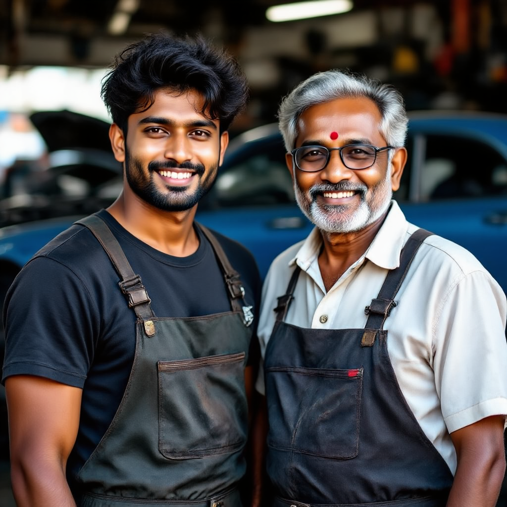
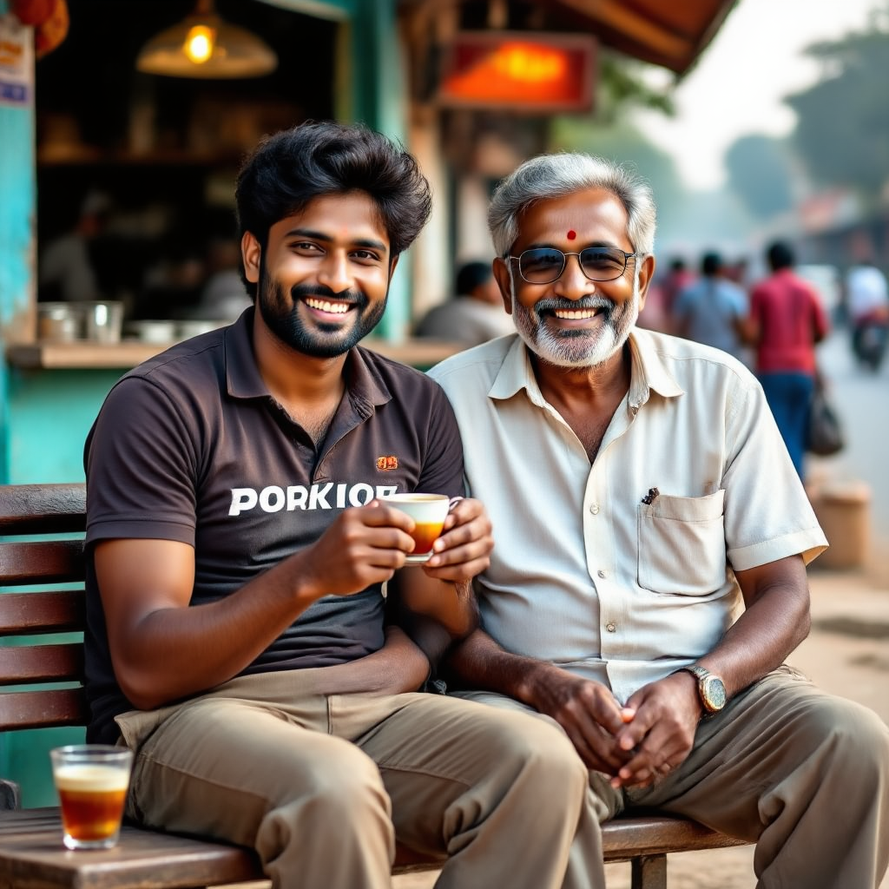
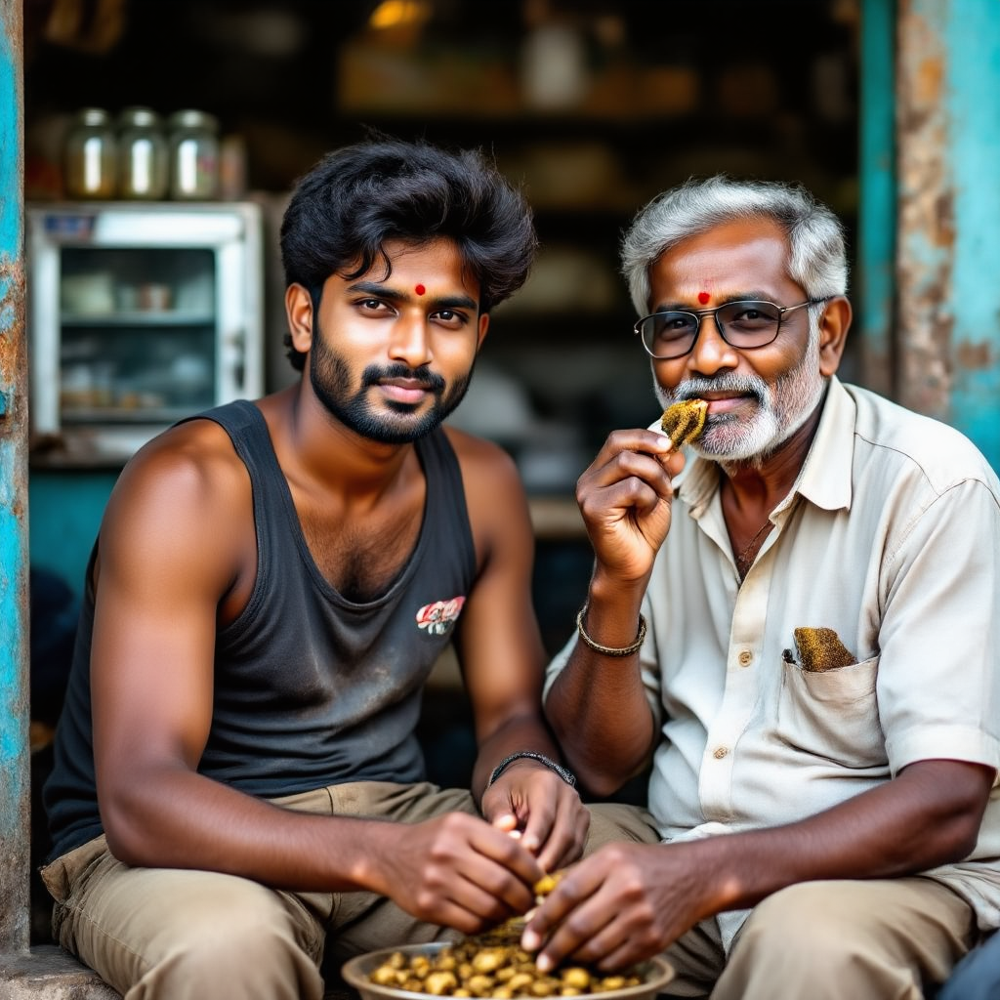

# Fine-Tuning for Dual Subject Character Consistency  

## Introduction  

If you’ve ever tried generating videos with multiple characters, you’ve probably run into the frustrating issue of *inconsistent faces* across scenes. 

For creators who care about storytelling, like those in the field of cinema, this is a serious limitation. Characters need to *stay* themselves—especially when they’re in the same story together. Achieving this means starting with high-quality “seed” images of each subject. Unfortunately, most popular fine-tuning methods, such as DreamBooth, struggle when more than one subject is involved. The most common culprit? **Feature bleeding**—when details from one character spill over into another.  

At **Dheyo AI**, we’ve been experimenting with ways to overcome this limitation. After a lot of trial, error, and fine-tuning, we’ve managed to generate *two* characters with consistent facial features across multiple scenes while keeping feature bleeding to a minimum.  

In this post, I’ll walk you through where current methods fall short, the approach we took, and some of the results we’ve been seeing.  

---

## Related Work  

Let’s quickly recap the existing landscape.  

**DreamBooth**  
DreamBooth introduced the idea of giving a character a unique identifier—like `[V] dog` or `sks woman`—and training the model to associate it with the subject’s appearance. The fine-tuning happens on the DiT block and optionally the text encoder. To prevent overfitting, regularization images and prompts are added to the mix.  
While DreamBooth can achieve impressive results, it has some known limitations—like lower prompt adherence and *context-appearance entanglement*. It’s also not immune to the dreaded multi-subject feature bleeding.  

**Textual Inversion**  
This is a lightweight alternative where nstead of fine-tuning the whole model, it learns a single token embedding to represent the character. It’s faster and less resource-heavy, but it tends to be less accurate than DreamBooth, especially when high fidelity is needed.  

**Instant ID** and **IP Adapter FaceID**  
These are training-free approaches that rely on image guidance instead of dataset-based fine-tuning. While convenient, they work best on faces of famous people. When it comes to less-photographed faces—especially those of Indian subjects—the results often fall short compared to DreamBooth or Textual Inversion.  

---

## Our Method  

Our solution is **built on top of** the OmniGen2 + LoRA combination. While OmniGen2 and LoRA form the foundation, our additions are specifically to push dual-subject character consistency further while minimizing feature bleeding even in complex, multi-scene generations.  

**Why OmniGen2?**
We chose to go with OmniGen2 because apart from image generation, it also showcases superior in-context image editing capabilities which can be further enhanced when our trained LoRA weights are loaded all while maintaing character consistency. OmniGen2 also has a lower memory footprint than other open-source models like HiDream-E1/I1

We enable:  

- More reliable identity preservation for each subject.  
- Strong separation between character features, reducing cross-contamination.  
- Flexibility to handle varied prompts and scene settings without retraining from scratch.  
- Character consistency in image editing.

This layered approach means we get the efficiency and adaptability of OmniGen2 + LoRA, *plus* the stability needed for multi-character video generation. 

---

## Experiments  

To really test the limits, we used two very different datasets:  

1. **Dataset 1** – A 33-year-old Indian man with a strong build.  
2. **Dataset 2** – A 70-year-old man with distinctly different facial features.  

We fine-tuned **OmniGen2** on a single AMD MI300X GPU for **just 2 GPU hours**—thanks to LoRA’s efficiency—running **6000 training steps** with:  

- Batch size: 2  
- Learning rate: 0.0002 (constant schedule)  
- Mixed precision training  
- LoRA rank: 16  

This setup let us experiment quickly while still producing high-quality results.  

---

## Results  

Let’s look at some side-by-side comparisons.  

**Prompt 1**  
> A detailed closeup picture of (([K] man)) and (([O] grandfather)), standing side by side, facing straight to the camera, inside a bustling car mechanic shed, both wearing work clothes, smiling confidently.  

| OmniGen2 LoRA | Ours |  
|:--------------:|:-----:|  
|  |  |  

**Prompt 2**  
> A detailed closeup of (([K] man)) and (([O] grandfather)), sitting on a bench at a roadside tea stall, sipping tea, facing the camera with joyful expressions, background with people chatting and chai glasses.  

| OmniGen2 LoRA | Ours |  
|:--------------:|:-----:|  
|  |  |  

**Prompt 3**
> A closeup of (([K] man)) and (([O] grandfather)), seated at a roadside paan shop, chewing paan, facing the camera with casual expressions, background showing a small fridge and glass jars.

| OmniGen2 LoRA | Ours |  
|:--------------:|:-----:|  
|  |  |  

We keep each character true to their identity while minimizing facial blending.  

---

## Future Work  

Our next challenge is to scale this up for *more than two* characters in the same scene. We’re also planning to experiment with other open-source image generation models like **Qwen-Image**, to see how well our method transfers.  

---

## Acknowledgements  

We thank **AMD** for providing access to their AMD Instinct™ MI300X GPUs. The combination of high memory capacity and blazing-fast compute performance allowed us to experiment at scale and shorten the training cycles.  

---

## References  

1. [OmniGen2: Exploration to Advanced Multimodal Generation](https://vectorspacelab.github.io/OmniGen2/)  
2. [LoRA: Low-Rank Adaptation of Large Language Models](https://iclr.cc/virtual/2022/poster/6319)  
3. [DreamBooth: Fine Tuning Text-to-Image Diffusion Models for Subject-Driven Generation](https://openaccess.thecvf.com/content/CVPR2023/html/Ruiz_DreamBooth_Fine_Tuning_Text-to-Image_Diffusion_Models_for_Subject-Driven_Generation_CVPR_2023_paper.html)  
4. [An Image is Worth One Word: Personalizing Text-to-Image Generation using Textual Inversion](https://textual-inversion.github.io)  
5. [HiDream-I1: A High-Efficient Image Generative Foundation Model with Sparse Diffusion Transformer](https://arxiv.org/abs/2505.22705)  
